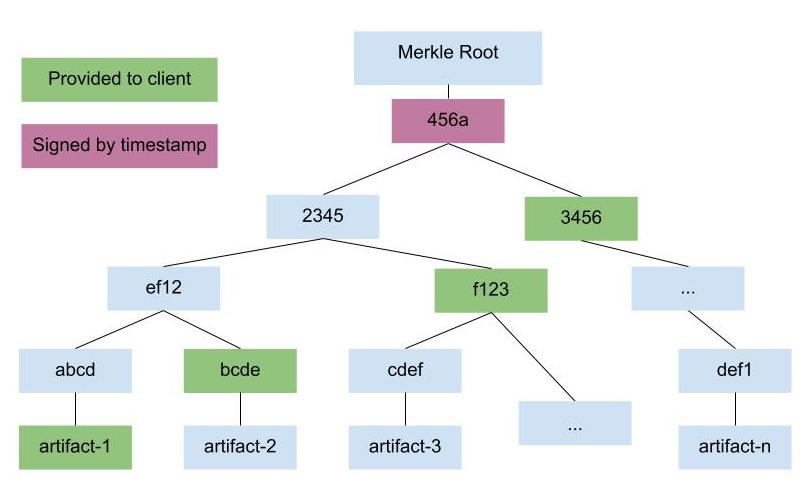

* TAP:
* Title: Snapshot Merkle Trees
* Version: 0
* Last-Modified: 17/09/2020
* Author: Marina Moore, Justin Cappos
* Type: Standardization
* Status: Draft
* Content-Type: markdown
* Created: 14/09/2020
* +TUF-Version:
* +Post-History:

 # Abstract

 To optimize the snapshot metadata file size for large registries, registries
 can use a snapshot Merkle tree to conceptually store version information about
 all images in a single snapshot without needing to distribute this entire
 snapshot to all clients. First, the client retrieves only a timestamp file,
 which changes according to some period p (such as every day or week). Second,
 the snapshot file is itself kept as a Merkle tree, with the root stored in
 timestamp metadata. This snapshot file is broken into a file for each target
 that contains the Merkle tree leaf with information about that target and a
 path to the root of the Merkle tree. A new snapshot Merkle tree is generated
 every time a new timestamp is generated. To prove that there has not been a
 reversion of the snapshot Merkle tree when downloading an image, the client
 and third-party auditors download the prior snapshot Merkle trees and check
 that the version numbers did not decrease at any point. To make this scalable
 as the number of timestamps increases, the client will only download version
 information signed by the current timestamp file. Thus, rotating this key
 enables the registry to discard old snapshot Merkle tree data.

The feature described in this TAP does not need to be implemented by all TUF
implementations. It is an option for any adopter who is interested in the
benefits provided by this feature, but may not make sense for implementations
with fewer target files.

# Motivation

For very large repositories, the snapshot metadata file could get very large.
This snapshot metadata file must be downloaded on every update cycle, and so
could significantly impact the metadata overhead. For example, if a repository
has 50,000,000 targets, the snapshot metadata will be about 380,000,000 bytes
(https://docs.google.com/spreadsheets/d/18iwWnWvAAZ4In33EWJBgdAWVFE720B_z0eQlB4FpjNc/edit?ts=5ed7d6f4#gid=0).
For this reason, it is necessary to create a more scalable solution for snapshot
metadata that does not significantly impact the security properties of TUF.

We designed a new approach to snapshot that improves scalability while
achieving similar security properties to the existing snapshot metadata


# Rationale

Snapshot metadata provides a consistent view of the repository in order to
protect against mix-and-match attacks and rollback attacks. In order to provide
these protections, snapshot metadata is responsible for keeping track of the
version number of each target file, ensuring that all targets downloaded are
from the same snapshot, and ensuring that no target file decreases its version
number (except in the case of fast forward attack recovery). Any new solution
we develop must provide these same protections.

A snapshot Merkle tree manages version information for each target by including
this information in each leaf node. By using a Merkle tree to store these nodes,
this proposal can cryptographically verify that different targets are from the
same snapshot by ensuring that the Merkle tree roots match. Due to the
properties of secure hash functions, any two leaves of a Merkle tree with the
same root are from the same tree.

In order to prevent rollback attacks between Merkle trees, this proposal
introduces third-party auditors. These auditors are responsible for downloading
all nodes of each Merkle tree to ensure that no version numbers have decreased
between generated trees. This achieves rollback protection without every client
having to store the version information for every target.

# Specification

This proposal replaces the single snapshot metadata file with a snapshot Merkle
metadata file for each target. The repository generates these snapshot Merkle
metadata files by building a Merkle tree using all target files and storing the
path to each target in the snapshot Merkle metadata. The root of this Merkle
tree is stored in timestamp metadata to allow for client verification. The
client uses the path stored in the snapshot Merkle metadata for a target, along
with the root of the Merkle tree, to ensure that metadata is from the given
Merkle tree. The details of these files and procedures are described in
this section.



## Merkle tree generation

When the repository generates snapshot metadata, instead of putting the version
information for all targets into a single file, it instead uses the version
information to generate a Merkle tree.  Each target’s version information forms
a leaf of the tree, then these leaves are used to build a Merkle tree. The
internal nodes of a Merkle tree contain the hash of the leaf nodes. The exact
algorithm for generating this Merkle tree (ie the order of leaves in the hash,
how version information is encoded), is left to the implementer, but this
algorithm should be documented in a POUF so that implementations can be
compatible and correctly verify Merkle tree data. However, all implementations
should meet the following requirements:
* Leaf nodes must be unique. A unique identifier of the target, such as the
filepath or hash must be included in the leaf data to ensure that no two leaf
node hashes are the same.
* The tree must be a Merkle tree. Each internal node must contain a hash that
includes both leaf nodes.

Once the Merkle tree is generated, the repository must create a snapshot Merkle
metadata file for each target. This file must contain the leaf contents and
the path to the root of the Merkle tree. This path must contain the hashes of
sibling nodes needed to reconstruct the tree during verification (see diagram).
In addition the path should contain direction information so that the client
will know whether each node is a left or right sibling when reconstructing the
tree.

This information will be included in the following metadata format:
```
{ “leaf_contents”: {METAFILES},
  “Merkle_path”: {INDEX:HASH}
  “path_directions”:{INDEX:DIR}
}
```

Where `METAFILES` is the version information as defined for snapshot metadata,
`INDEX` provides the ordering of nodes, `HASH` is the hash of the sibling node,
and `DIR` indicates whether the given node is a left or right sibling.

In addition, the following optional field will be added to timestamp metadata.
If this field is included, the client should use snapshot Merkle metadata to
verify updates instead:

```
("merkle_root": ROOT_HASH)
```

Where `ROOT_HASH` is the hash of the Merkle tree root.

Note that snapshot Merkle metadata files do not need to be signed by a snapshot
key because the path information will be verified based on the Merkle root
provided in timestamp. Removing these signatures will provide additional space
savings for clients.

## Merkle tree verification

If a client sees the `merkle_root` field in timestamp metadata, they will use
the snapshot Merkle metadata to check version information. If this field is
present, the client will download the snapshot Merkle metadata file only for
the target the client is attempting to update. The client will verify the
snapshot Merkle metadata file by reconstructing the Merkle tree and comparing
the computed root hash to the hash provided in timestamp metadata. If the
hashes do not match, the snapshot Merkle metadata is invalid. Otherwise, the
client will use the version information in the verified snapshot Merkle
metadata to proceed with the update.

For additional rollback protection, the client may download previous versions
of the snapshot Merkle metadata for the given target file. After verifying
these files, the client should compare the version information in the previous
Merkle trees to the information in the current Merkle tree to ensure that the
version numbers have never decreased. In order to allow for fast forward attack
recovery (discussed further in Security Analysis), the client should only
download previous versions that were signed with the same timestamp key.

## Auditing Merkle trees

In order to ensure the validity of all target version information in the
Merkle tree, third-party auditors should validate the entire tree each time it
is updated. Auditors should download every snapshot Merkle file, verify the
paths, check the root hash against the hash provided in timestamp metadata,
and ensure that the version information has not decreased for each target.
Alternatively, the repository may provide auditors with information about the
contents and ordering of leaf nodes so that the auditors can more efficiently
verify the entire tree.

Auditors may provide an additional signature for timestamp metadata that
indicates that they have verified the contents of the Merkle tree whose root
is in that timestamp file. Using this signature, clients can check whether a
particular third party has approved the Merkle tree.

## Garbage collection
When a threshold of timestamp keys are revoked and replaced, the repository no
longer needs to store snapshot Merkle files signed by the previous timestamp
key. Replacing the timestamp key is an opportunity for fast forward attack
recovery, and so all version information from before the replacement is no
longer valid. At this point, the repository may garbage collect all snapshot
Merkle metadata files.

# Security Analysis

This proposal impacts the snapshot metadata, so this section will discuss the
attacks that are mitigated by snapshot metadata in TUF.

## Rollback attack

In the event that the timestamp key is compromised, an attacker may provide an
invalid Merkle tree that contains a previous version of a target. This attack
is prevented by both the client’s verification and by auditors. When the client
verifies previous versions of the snapshot Merkle metadata for a target, they
ensure that the version number of that target has not decreased. However, if
the attacker controls the timestamp key(s) and the repository, the previous
snapshot Merkle metadata downloaded by the client may also be invalid. To
protect against this case, third party auditors store the previous version of
all metadata, and will detect when the version number decreases in a new
Merkle tree. As long as the client checks for an auditor’s verification, the
client will not install the rolled-back version of the target.

## Fast forward attack

If an attacker is able to compromise the timestamp key, they may arbitrarily
increase the version number of a target in the snapshot Merkle metadata. If
they increase it to a sufficiently large number (say the maximum integer value),
the client will not accept any future version of the target as the version
number will be below the previous version. To recover from this attack,
auditors and clients should not check version information from before a
timestamp key replacement. This allows a timestamp key replacement to be used
as a reset after a fast forward attack. The existing system handles fast
forward attack recovery in a similar manner, by instructing clients to delete
stored version information after a timestamp key replacement.

## Mix and match attack

A snapshot Merkle tree prevents mix and match attacks by ensuring that all
targets files installed come from the same snapshot Merkle tree. If all targets
have version information in the same snapshot Merkle tree, the properties of
secure hash functions ensure that these versions were part of the same snapshot.


# Backwards Compatibility

This TAP is not backwards compatible. The following table describes
compatibility for clients and repositories.

| Parties that support snapshot Merkle trees | Result |
| ------------------------------------------ | ------ |
| Client and repository support this TAP | Client and repository are compatible |
| Client supports this TAP, but repository does not | Client and repository are compatible. The timestamp metadata provided by the repository will never contain the `merkle_root` field, and so the client will not look for snapshot Merkle metadata. |
| Repository supports this TAP, but client does not | Client and repository are not compatible. If the repository uses snapshot Merkle metadata, the client will not recognise the `merkle_root` field as valid. |
| Neither client nor repository supports this TAP | Client and repository are compatible |

# Augmented Reference Implementation

https://github.com/theupdateframework/tuf/pull/1113/
TODO: auditor implementation

# Copyright

This document has been placed in the public domain.
