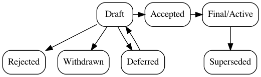

* TAP: 1
* Title: TAP Purpose and Guidelines
* Version: 2
* Last-Modified: 28-Jul-2020
* Author: Trishank Karthik Kuppusamy, Lois Anne DeLong, Justin Cappos, Joshua Lock
* Status: Active
* Content-Type: text/markdown
* Created: 07-Sep-2016
* Post-History: 08-Sep-2016

# What is a TAP?

TAP stands for TUF Augmentation Proposal and is largely modeled after a similar type of document used in the Python Enhancement Proposal (https://www.python.org/dev/peps/pep-0001/) process.  A TAP is a design document that either provides information to the TUF community, or describes a new feature for TUF or for its processes or environment.  The TAP should provide both a concise technical specification of the feature and a rationale for the feature's inclusion.

We intend TAPs to be the primary mechanisms for proposing major new features, for collecting community input on an issue, and for documenting the design decisions that have gone into TUF.  The TAP author is responsible for building consensus within the community and documenting dissenting opinions.

Because the TAPs are maintained as text files in a versioned repository, their revision history is the historical record of the feature proposal.

# TAP Types

There are two kinds of TAPs:
1. A **Standardization** TAP proposes new features for, or changes to the existing behavior of, the TUF specification.
2. An **Informational** TAP describes a design issue, or provides general guidelines or information for TUF implementers.

# TAP Status

The status of a TAP indicates its progress through the development process. The different status classifications are defined below. Unless otherwise specified, each status applies to both kinds of TAP.

* A **Draft** TAP is one that has been proposed and is actively being worked on.
* **Active** TAPs are Informational TAPs that are expected to change as the specification and the processes around it evolve.
* An **Accepted** Standardization TAP is deemed ready to be integrated into the specification and augmented reference implementation.
* **Deferred** TAPs are potentially good ideas which are not being actively developed, or where progress is not being made.
* A **Rejected** TAP is one which the [TAP editors](#tap-editors) have decided is ultimately not a good idea.
* **Withdrawn** TAPs are submissions which the champion, or lead author, of the TAP has decided are no longer worth pursuing.
* **Final** TAPs are complete and will no longer change. For Standardization TAPs this means the proposed changes have been merged into the augmented reference implementation and the specification.
* A **Superseded** TAP is one which has been rendered obsolete by a newer TAP.

# TAP Workflow

## Consensus Builder

The consensus builder for the TUF specification is Prof. Justin Cappos of the NYU Secure Systems Lab.
Ultimate authority for changes to the TUF specification, including changes proposed through this TAP process, falls to the specification's consensus builder.

## TAP Editors

The TAP Editors are a team of core contributors to the TUF project who are responsible for reviewing and approving or rejecting any proposed TAPs.

## Start with an Idea

The TAP process begins with a new idea for TUF.  It is highly recommended that each TAP contain only a single key proposal or new idea. Small enhancements or patches often do not require a TAP and can be injected into the TUF development workflow with a patch submission to the [TUF specification](https://github.com/theupdateframework/specification).

The more focused the TAP, the more successful it tends to be.  The [TAP Editors](#tap-editors) reserve the right to reject TAP proposals if they appear too unfocused or too broad.  If in doubt, split your TAP into several well-focused ones.

Each TAP MUST have a champion -- someone who writes the TAP using the style and format described below, shepherds the discussions in the appropriate forums, and attempts to build community consensus around the idea.  The TAP champion (a.k.a. Author) SHOULD first attempt to ascertain whether the idea is TAP-able. Posting to the TUF [issue tracker](https://github.com/theupdateframework/specification/issues), the [#tuf channel](https://cloud-native.slack.com/archives/C8NMD3QJ3) on CNCF Slack, or the [TUF mailing list](https://groups.google.com/forum/?fromgroups#!forum/theupdateframework) are good ways to go about this.

## Submitting a TAP

Once the champion has asked the TUF community whether an idea has any chance of acceptance, a draft TAP SHALL be presented as a [pull request](https://github.com/theupdateframework/taps/pulls) to the TAPs repository.  The draft MUST be written in TAP style as described below and in [TAP 2](tap2.md), or it will immediately fail review.

Once a submission is approved for inclusion in the TAP repository, the TAP Editors will assign it a number, mark its status as "Draft", and merge the initial draft.  The [TAP Editors](#tap-editors) will not unreasonably deny Draft status to a TAP.  Reasons for denying a TAP include duplication of effort, being technically unsound, not providing proper motivation or addressing backwards compatibility, or not in keeping with the TUF philosophy.  [TAP Editors](#tap-editors) may be consulted during the approval phase, with the [Consensus Builder](#consensus-builder) as the final arbiter of the  draft's viability as a TAP.

As updates are necessary, the TAP author can submit new versions by opening additional [pull requests](https://github.com/theupdateframework/taps/pulls) against the TAPs repository.

Standardization TAPs consist of two parts, a design document and an augmented reference implementation. It is generally recommended that at least a prototype implementation be co-developed with the TAP, as ideas that sound good in principle sometimes turn out to be impractical when subjected to the test of implementation. However, a prototype is not required by the TAP process until the TAP is in the "Accepted" status. No TAP will be marked as "Final" until an augmented reference implementation is available.

TAP authors are responsible for collecting community feedback on a TAP before submitting it for review. All comments should be gathered on a [GitHub issue](https://github.com/theupdateframework/taps/issues) specific to the TAP. It is recommended that feedback be solicited via the [TUF mailing list](https://groups.google.com/forum/?fromgroups#!forum/theupdateframework).

## TAP Review & Resolution

Once feedback has been gathered, a change of the TAP to "Accepted" status MUST be requested via the TAPs [issue tracker](https://github.com/theupdateframework/taps/issues) or a [pull request](https://github.com/theupdateframework/taps/pulls).  TAPs are reviewed by the [TAP Editors](#tap-editors), who may accept or reject a TAP or send it back to the author(s) for revision. For a TAP that is predetermined to be acceptable (e.g., it is an obvious win as-is and/or its implementation has already been checked in) the TUF team may also initiate a TAP review, first notifying the TAP author(s) and giving them a chance to make revisions. In order for a Standardization TAP to be "Accepted", it MUST have a corresponding prototype implementation for the reference implementation.

In order to move a Standardization TAP from "Accepted" to "Final" status, the augmented reference implementation MUST be completed and merged, and any proposed specification changes MUST be integrated into the specification.

For an Informational TAP, no changes are expected to the augmented reference implementation or specification. Therefore, a TAP may move to "Final" status, without moving through the "Accepted" status, once it is deemed ready by the TAP editors.

Some informational TAPs may have a status of "Active" if they are not meant to be completed, for example TAP 1 (this TAP).

A TAP can also be "Rejected,"  if it becomes evident to the TAP editors that the proposed change was not a good idea.  In this case, the "Rejected" status serves as a record of this decision. The "Withdrawn" status serves a similar function. In this case, it is the author who has decided that the TAP is actually a bad idea, or has accepted that a competing proposal is a better alternative.

When a TAP is Accepted, Rejected, or Withdrawn, the TAP should be updated accordingly.

TAPs can also be "Superseded" by a different TAP, rendering the original obsolete.

Possible paths for a TAP are:

## TAP Maintenance

In general, TAPs are no longer modified after they have reached the "Final" state. Once a TAP has been completed, the Specification becomes the formal documentation of the expected behavior.
Informational TAPs in the "Active" state may continue to be updated via pull request to the TAPs repository.

# What belongs in a successful TAP?

Each TAP SHOULD have the following parts:

1. *Preamble* -- [RFC 822](https://tools.ietf.org/html/rfc822) style headers containing meta-data about the TAP, including the TAP number, a short descriptive title (limited to a maximum of 44 characters), the names, and optionally the contact info for each author, etc.

2. *Abstract* -- a short (~200 word) description of the technical issue being addressed.

3. *Motivation* -- The motivation is critical for TAPs that want to change TUF. It should clearly explain why the existing framework specification is inadequate to address the problem that the TAP solves.  TAP submissions without sufficient motivation may be rejected outright.

4. *Rationale* -- The rationale fleshes out the proposal by describing what motivated the design and why particular design decisions were made. It should describe any alternate designs that were considered and how the feature is supported in other frameworks using related works. The rationale should also provide evidence of consensus within the community and discuss important objections or concerns raised during discussion.

5. *Specification* -- The technical specification should describe the syntax and semantics of any new feature.  The specification should be detailed enough to allow competing, interoperable implementations for at least the current major TUF platforms (TUF, Notary, go-tuf).

6. *Security Analysis* -- The TAP should show, as simply as possible, why the proposal would not detract from existing security guarantees. (In other words, the proposal should either maintain or add to existing security.) This need not entail a mathematical proof. For example, it may suffice to provide a case-by-case analysis of key compromise over all foreseeable roles. To take another example, if a change is made to a delegation, it must preserve existing delegation semantics (unless the TAP makes a good argument for breaking those semantics).

7. *Backwards Compatibility* -- All TAPs that introduce backwards incompatibilities must include a section describing these incompatibilities, their severity, and how the author proposes to deal with them.  TAP submissions without a sufficient backwards compatibility treatise may be rejected outright.

8. *Augmented Reference Implementation* -- The augmented reference implementation must be completed before any TAP is given "Final" status, but it need not be completed before the TAP is accepted as "Draft". While there is merit to the approach of reaching consensus on the specification and rationale before writing code, the principle of "rough consensus and running code" is still useful when it comes to resolving many discussions of API details. The final implementation must include test code and documentation appropriate for the TUF reference.

9. *Copyright* -- Each TAP must either be explicitly labeled as placed in the public domain (see this TAP as an example) or licensed under the [Open Publication License](https://opencontent.org/openpub/).

# TAP Formats and Templates

TAPs are UTF-8 encoded text files using the [Markdown](https://daringfireball.net/projects/markdown/) format. Markdown allows for rich markup that is still quite easy to read, but also results in good-looking and functional HTML.

In-line with the Specification, the keywords "MUST," "MUST NOT," "REQUIRED," "SHALL," "SHALL NOT," "SHOULD," "SHOULD NOT," "RECOMMENDED," "MAY," and "OPTIONAL" in a TAP are to be interpreted as described in [RFC 2119](https://tools.ietf.org/html/rfc2119).

[TAP 2](https://github.com/theupdateframework/taps/blob/master/tap2.md) contains a template for MarkDown TAPs.

# TAP Header Preamble

Each TAP MUST begin with an RFC 822 style header preamble. The headers MUST appear in the following order. Headers marked with "+" are OPTIONAL and are described below. All other headers are required.

* TAP: <TAP number>
* Title: <TAP title>
* Version: <version string>
* Last-Modified: <date string>
* Author: <list of authors' real names and optionally, email addresses>
* Type: <Standardization | Informational>
* Status: <Draft | Active | Accepted | Deferred | Rejected | Withdrawn | Final | Superseded>
* +Content-Type: <text/markdown>
* +Requires: <pep numbers>
* Created: <date created on, in dd-mmm-yyyy format>
* +TUF-Version: <version number>
* +Replaces: <TAP number>
* +Superseded-By: <TAP number>

The Author header lists the names, and optionally the email addresses of all the authors/owners of the TAP.  The format of the Author header value SHOULD be "Random J. User <address@dom.ain>".

The format of a TAP is specified with a Content-Type header. The acceptable values are "text/markdown" for Markdown TAPs (see [TAP 2](https://github.com/theupdateframework/taps/blob/master/tap2.md)). Markdown ("text/markdown") is the default if no Content-Type header is present.

The Created header records the date that the TAP was assigned a number and SHOULD be in dd-mmm-yyyy format, e.g. 14-Aug-2001.

TAPs will typically have a TUF-Version header which indicates the version of TUF that the feature will be released with. TAPs that refer to processes or recommendations do not require a TUF-Version header.

TAPs MAY have a Requires header, indicating the TAP numbers on which this TAP depends. 

TAPs MAY also have a Superseded-By header indicating that it has been rendered obsolete by a later document; the value is the number of the TAP that replaces the current document.  The newer TAP must have a Replaces header containing the number of the TAP that it rendered obsolete.

# Auxiliary Files

TAPs MAY include auxiliary files such as diagrams. These files MUST be named ``tap-XXXX-Y.ext``, where "XXXX" is the TAP number, "Y" is a serial number (starting at 1), and "ext" is replaced by the actual file extension (e.g. "png").

# Reporting TAP Bugs, or Submitting TAP Updates

The procedure for reporting a bug, or submitting a TAP update depends on several factors, such as the maturity of the TAP, the preferences of the TAP author, and the nature of the comments.  For Draft or Accepted TAPs, feedback should be via the TAPs [issue tracker](https://github.com/theupdateframework/taps/issues) or as a pull request against the TAP in question.
Once a TAP has been marked Final, bugs or corrections SHOULD be submitted to the TUF [issue tracker](https://github.com/theupdateframework/tuf/issues) so that changes do not get lost.

# Transferring TAP Ownership

It occasionally becomes necessary to transfer ownership of TAPs to a new champion. In general, it is preferable to retain the original author as a co-author of the transferred TAP, but that is really up to the individual.  A good reason to transfer ownership is because the original author no longer has the time or interest in updating it or following through with the TAP process, or is unreachable (or not responding to email).  A bad reason to transfer ownership is because the author doesn't agree with the direction of the TAP.  One aim of the TAP process is to try to build consensus around a TAP, but if that's not possible, an author can always submit a competing TAP.

If you are interested in assuming ownership of a TAP, send a message stating that request to both the original author and the [TUF mailing list](https://groups.google.com/forum/?fromgroups#!forum/theupdateframework). If the original author does not respond to the email in a timely manner, the TUF team will make a unilateral decision, though such decisions may be reversible.

# Copyright

This document has been placed in the public domain.

# Acknowledgements

This TAP was heavily borrowed from [PEP 1](https://www.python.org/dev/peps/pep-0001/).
