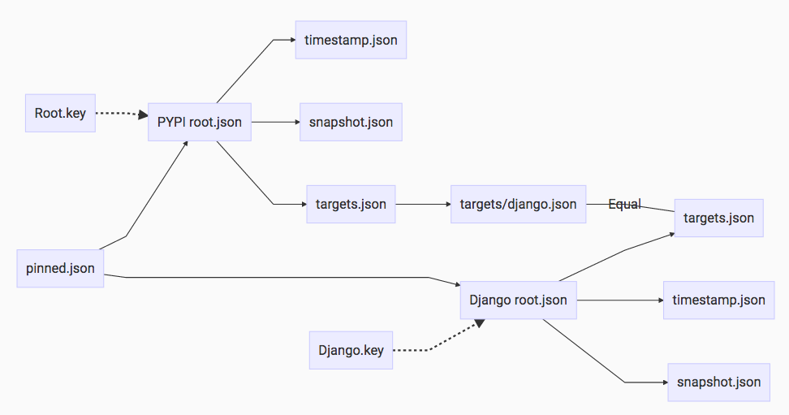

* TAP: 4
* Title: Trust Pinning
* Version: 1
* Last-Modified: 14-Sep-2016
* Author: Evan Cordell, Jake Moshenko, Justin Cappos, Vladimir Diaz, Sebastien Awwad, Trishank Karthik Kuppusamy
* Status: Draft
* Content-Type: text/markdown
* Created: 09-Sep-2016
* Post-History: 09-Sep-2016

# Abstract

This is a proposal of a design for pinning trusted keys, which would allow
clients to root their trust at a namespace (or lower) delegated set of keys
instead of the repository root.

An example use case: a client trusts Django's published public keys to have
signed off on Django, but the client does not trust PyPI to remain
uncompromised (and possibly convince the client of different public keys for
Django).

Because of its similarity to normal delegations (delegations from the targets
role and its delegates), the proposed pinning feature can be thought of as
repository- or root-level delegation.

As a helpful side-effect, the proposed pinning feature also addresses the
problem of private metadata. In the current TUF spec, there is no way to hide
all information about the existence of other metadata in the system. This is a
problem in a multi-tenant scenario where knowledge of meta-metadata could be
sensitive (e.g. timing of creating a target, names of targets, etc).

# Specification

We introduce a new, required, client-side, top-level metadata file,
`pinned.json`, which permits users to pin root files and associate them with
a particular namespace prefix (or glob/pattern). If an entry matches the
current package, the pinned root must be used. If it does not match, there is a
fallback to the global root.

This constructs two (or more) trust paths for target files, and allows the user
to pick between them. Clients that trust the global root (e.g. PyPI) will trust
all packages served by it, and those that wish to root trust with a namespace
owner (e.g. Django project) can pin to those keys. See the following diagram
for an example:



Because the pinning mechanism uses roots, the "pinned" keys may be rotated
according to the standard root rotation scheme. In that sense, you are pinning
the root of a tree of keys which can grow over time, rather than pinning a set
of keys that must never change.

## Pin File

`pinned.json` maps a prefix to a location where the pinned root can be found
and an optional url for updating it. This file is not available from a TUF
repository. It is either constructed by explicit actions from the client (e.g.
"pin this role's keys") or by an out-of-band bootstrap (e.g. "here's our
organization's `pinned.json`").

### Fields for each pinning specification

```pinned.json``` contains a dictionary D1. D1 contains two keys, "repositories" and "delegations".

The value of the "repositories" key in D1 is a dictionary D2. Every key in D2 specifies a shortname for a repository (e.g., "django"). Every value in D2 is a dictionary D3 with at least one key: "metadata_directory" which contains the previous and current metadata for this repository. D3 may also contain the "url" key, which specifies the complete URL needs to resolve metadata and targets.

The value of the "delegations" key in D1 is a list L1. Every member in L1 is a dictionary D4 with at least two keys: "paths" which specifies a target path, and "repositories" which specifies a list L2. L2 contains one or more keys, or repository shortnames, from D2. D4 may also contain the "terminating" key, which is a Boolean attribute indicating whether or not this delegation terminates backtracking in the absence of the required number of signatures for a matching target.

The following is an example of D1:

```javascript
{
  "repositories": {
    "django": {
      // metadata would be at https://repository.djangoproject.com/metadata/
      // targets would be at  https://repository.djangoproject.com/targets/
      "url": "https://repository.djangoproject.com/",
      // previous metadata on disk would be in metadata/previous/django
      // current metadata on disk would be in metadata/current/django
      "metadata_directory": "django"
    },
    "PyPI": {
      "url": "https://pypi.python.org/repository/",
      "metadata_directory": "pypi"
    },
    "Flask": {
      "url": "https://flask.pocoo.org/",
      "metadata_directory": "flask.pocoo.org"
    }
  },
  "delegations": [
    {
      "paths": "*django*",
      "repositories": ["django"],
      // if the "terminating" Boolean attribute is missing, its default value is false
      terminating: true
    },
    {
      "paths": "*flask*",
      "repositories": ["Flask", "PyPI"]
    },
    {
      "paths": "**",
      "repositories": ["PyPI"]
    }
  ]
}
```

## Delegation Features Applicable to Trust Pinning

The assignment of portions of the targets namespace to distinct
roots/repositories is similar to a normal, targets delegation. As such, it can
also profit from targets delegation features like non-backtracking (a.k.a.
terminating or cutting) delegations or multi-role delegations (here, more
appropriately termed multi-repository delegations).

### Feature: Backtracking Pinning Delegations

Normal delegations can be backtracking (default) or terminating. This delegation feature is documented in [the Diplomat paper](https://www.usenix.org/conference/nsdi16/technical-sessions/presentation/kuppusamy).
The same concept can be applicable to pinned delegations. If a portion of the
targets namespace is assigned to a particular root/repository, and that
repository does not specify a particular target in that namespace, TUF could
choose either to proceed through the list of pinnings to the next pinning whose
assigned namespace matches that target (i.e. TUF could backtrack) or not; it
would seem that the naturally expected behavior from a namespace assignment
would be *not* to backtrack.

As such, pinnings (i.e. repository delegations) should by default not
backtrack; however, it should probably remain an option to allow backtracking.

### Feature: Multi-Repository Pinning Delegations

Absent pinning, multi-role delegations are a form of delegation that assigns
restricted paths of the targets namespace not to one child role but to a
combination of roles. (TODO: Link to Multi-Role Delegation TAP). Just as with
such delegations, pinned delegations can profit from the same logic.

### Feature: Unix-Style Target Filename Pattern Matching (Wildcards)

A normal delegation in TUF 1.0 features target filename matching either by
filename prefix or by Unix-style filename pattern matching. The same option
will be made available for pinning.

### Interpretating delegations

Every delegation in [the list L1](#fields-for-each-pinning-specification) shall be interpreted as follows. If the desired target matches the "paths" attribute, then download and verify metadata from every repository specified in the "repositories" attribute. Ensure that the targets metadata about the target matches across repositories (i.e., all repositories must provide the same hashes, length, and custom attributes), and return metadata about the target. If all repositories in the current delegation have not signed any metadata about the target, then take one of the following two actions. If the "terminating" attribute is true, report that there is no metadata about the target. Otherwise, proceed to similarly interpret the next delegation.

## Pinned Metadata
Pinned metadata lives in a specific default directory, sharing the same layout as a "normal" repo but nested within a prefix namespace, e.g.

```
metadata
└── previous/django // use the name from "metadata_directory"
    ├── root.json
    ├── snapshot.json
    ├── targets.json
    └── timestamp.json
└── previous/flask.pocoo.org
└── previous/pypi
└── current/django
└── current/flask.pocoo.org
└── current/pypi
```

This can be changed with the `location` field of the `pinned.json` file, which
may be useful if e.g. sharing a network drive.

Complex ACLs can be enforced and/or bootstrapped by sending a user an
appropriately generated `pinned.json`, noting that any metadata endpoint (root
repo, or any pinned repo) can have its own access control mechanism.

## Hiding 

A private package can be omitted from the primary hierarchy entirely, having
its own `snapshot` and `target` files separate from those provided with `root`.
The `snapshot.json` and `target.json` could be signed with the same snapshot
and target keys used for the public parts of the repository, or they can be
managed and signed by the owner of the private delegated role. Access to these
private roles is granted by sending the metadata to the appropriate users
(further restricted by ACLs if needed). A url pointing to where the snapshot
and timestamp can be found is added to the `pinned.json` file in the case of
private roles.

## Hard Pinning		
		
Hard pinning, in which a specific set of non-changing keys are used, can be		
accomplished by creating the a pinned metadata repository and not specifying a		
url. Without a url, nothing can convince a client to use different keys. This		
may be useful for priming a box for a one-time initial pull (with the		
assumption that it will be killed rather than updated directly).		
 		
The result of pinning a namespace without specifying a url is that, for that
namespace, top level metadata (role files) cannot be changed by a repository:
the user would have to explicitly pin new metadata.		
 
## Repository structure

With this pinning structure it makes sense to structure namespaces and/or
packages with their own roots. Alternately, a user can generate a root for a
given package/target delegation locally if it doesn't exist, by generating keys
locally and signing.

Because a delegation is also a target file, a global root can delegate to
target files of other repos. This allows a simple way to provide both global
and namespaced target files.

# Motivation

See Abstract.

# Rationale

See Abstract.

# Security Analysis

In effect, this TAP allows users (and only users) to directly choose the root
of trust for parts of the targets namespaces. Each root continues to be treated
as it was previously, with TUF performing full validation per that root's
metadata.

The proposed pinning feature provides users the ability to constrain the
effects on them of metadata changes at the repository. As such, it creates two
behavioral risks for users:

- Orphaned pinnings, in effect, may occur, where metadata is pinned and then fails to be updated, falling out of sync with keys in real use. Project managers may trust their own security and distrust repository security, promoting pinning to users for their own projects. Smaller groups, however, may be less likely to follow up on updating metadata when that is appropriate, often having more constrained means and broader interests than repository metadata. To provide a url for updating pinned metadata is essentially to run one's own TUF server.
- Complexity / subtlety for users and maintainers of having multiple repositories. (TODO: Elaborate.)
- TODO: Poll for other concerns.

# Backwards Compatibility

In principle, the functionality can be backwards compatible. If no pinning is
employed, things should function exactly as before, and pinning occurs at the
client side, being completely transparent to a TUF repository.

On the client side, based on the planned implementation, the pinned.json
metadata file is required (though by default it should simply "delegate" the
full namespace to the existing repository's root.json), and so client
metadata must be updated slightly to support this feature, as pinned.json is
not an optional file.

# Augmented Reference Implementation

# Copyright

This document has been placed in the public domain.

# Acknowledgements

It is worth mentioning that Notary has a pinning implementation currently.
Although this proposal differs and has slightly different goals, the Notary
format should be compatible with this through a simple transformation.

